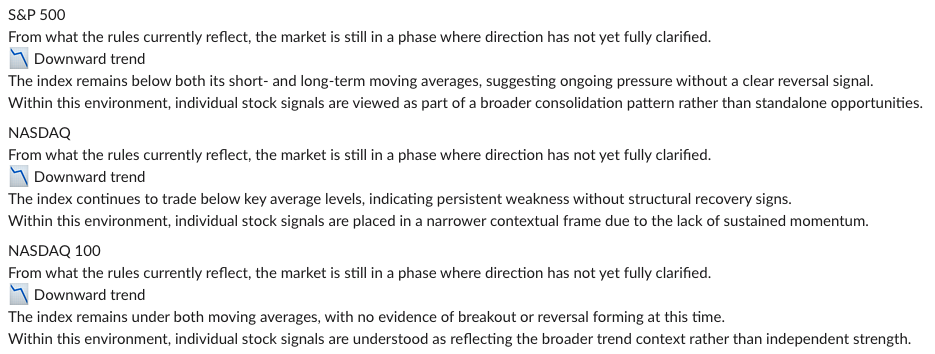
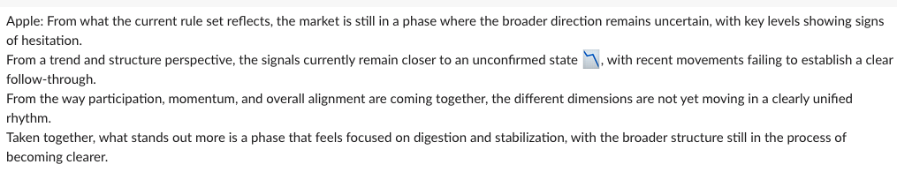
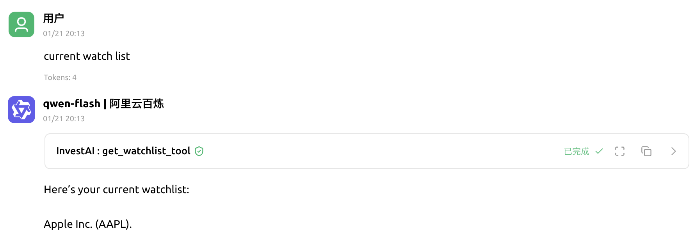
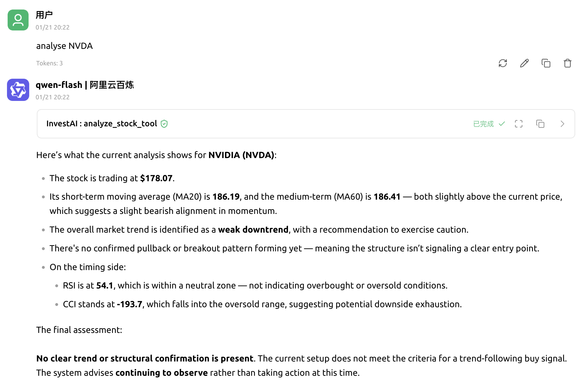
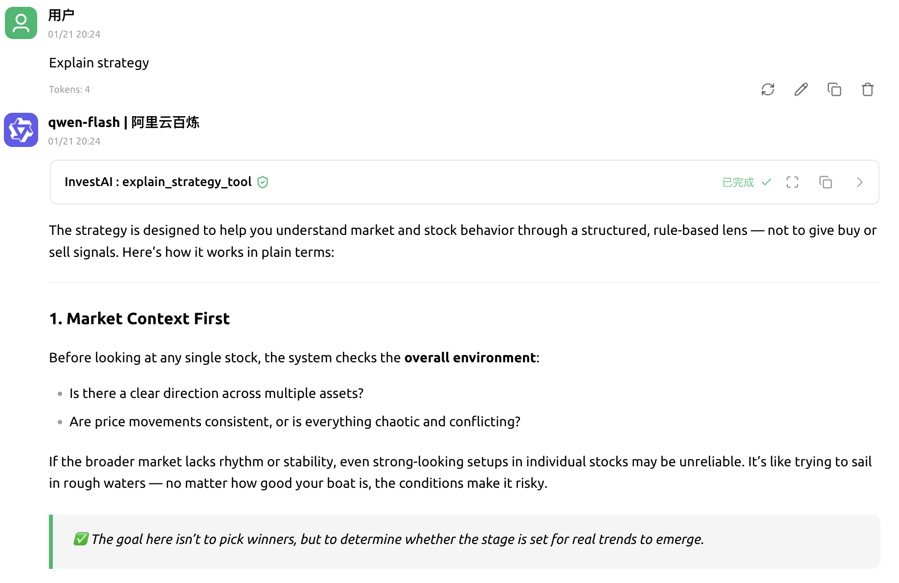
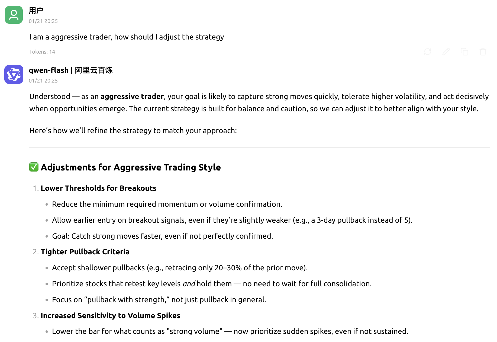

# InvestAI 🚀


**An AI-powered investing assistant for everyday investors**

> AI helps you stay rational.
> Decisions are still yours.

## Project Overview

InvestAI is an AI-powered investment assistant designed for **everyday investors**.

It does not place trades, and it does not make investment decisions for you.
InvestAI focuses on only two things:

* **Analyzing the market based on well-established trading rules**
* **Highlighting signals that may deserve your attention at key moments**

Whether to buy, sell, or continue holding is **always a human decision**.

The goal of this project is not to “increase win rates,” but to help investors **consistently apply a long-term, disciplined investment approach in real market conditions.**

---

## Why InvestAI Exists

Many investment problems are not really about “not knowing how to pick stocks,” but about things like:

* Being impulsive when entering a position
* Not being able to hold through declines
* Taking profits too early
* Only realizing afterward that you had already drifted away from your original plan

The rules themselves are often not that complicated.
What’s difficult is **executing them consistently, calmly, and over long periods of time**.

The role of InvestAI is to step in at the moments when emotions are most likely to interfere,
and **put the rules back in front of you — reminding you what is actually happening right now.**

---

## Core Design Philosophy

InvestAI draws inspiration from established trading philosophies such as **The Turtle Trading Rules**, but makes one deliberate choice:

> **Let AI execute the rules. Keep decisions in human hands.**

Its core principles include:

* Not trying to be right every time
* Accepting small losses as a normal cost
* Clearly separating “signals” from “decisions”
* Making every analysis explainable and traceable

AI’s responsibility is to **tell you whether a rule has been triggered**,
not to tell you “you must buy” or “you must sell.”

---

## What InvestAI Does

For the stocks you follow, InvestAI continuously analyzes them based on a fixed rule system and reports things like:

* Whether a reference buy signal has appeared
* Whether risk or stop-related conditions have been triggered
* Whether the current trend structure is still intact
* Whether the situation is better interpreted as a waiting phase

At their core, these outputs are all answering one question:

> **If you strictly followed this rule set, how should this stock be “viewed” right now?**

---

## What InvestAI Does *Not* Do

To avoid misunderstandings, InvestAI deliberately does **not** provide:

* ❌ Automated trading or order execution
* ❌ “Sure-win stocks” or aggressive buy recommendations
* ❌ Short-term predictions or high-frequency signals
* ❌ Black-box scores or unexplained conclusions

It is not a “stock-picking tool.”
It is a **rule execution and rule awareness tool.**

---

## Why Use AI Instead of Traditional Indicator Tools?

Many investors already know how to read indicators. The problem is that:

* There are too many of them, and it’s unclear which to trust
* Different timeframes give conflicting signals
* Once emotions are involved, unfavorable information is often ignored

InvestAI is meant to:

* Integrate multiple rules into a single, explainable analytical process
* Apply the same logic consistently, every time
* Surface reminders precisely when risks are easiest to overlook or optimism becomes excessive

It is closer to a **calm investment companion that doesn’t argue with you — but doesn’t indulge you either.**

---

## Example Strategy Rules

InvestAI doesn’t rely on vague “gut feeling” analysis—it operates based on a **clear, configurable set of trading rules**.

Below is an **example trend-following strategy** to illustrate how InvestAI generates buy/sell reference signals.

> ⚠️ This is just an example strategy, not the only or optimal approach.
> All parameters can be adjusted to fit individual trading styles.

## 1. Market Trend and Environment

Before analyzing any individual stock, InvestAI will **first assess the overall market environment**.

Because in most cases:

> **The market determines the probability of success, while individual stocks determine the potential return.**

## 2. Individual Stock Trend and Breakout Conditions

```yaml
trend:
  pullback_threshold: 0.03 # Pullback threshold (3%)
  resistance_window: 20 # Resistance window for breakout confirmation (N previous days)
  breakout_buffer: 0.005 # Breakout buffer ratio (0.5%)
```

**Strategy Overview:**

- Based on **moving averages (ma20 and ma60)** to analyze stock trends.
- Waits for **controllable pullbacks (≤3%)** to avoid overtrading.
- Uses the **recent 20-day price range** to calculate key resistance levels.
- Only when the price **breaks above the highest price in the past N days** (plus the buffer ratio),
  is it considered a valid breakout.

👉 AI will judge:

> Is this a normal pullback within the trend,
> or is it a “passive decline” in a weak market environment?

## 3. Volume Confirmation (Volume)

```yaml
volume:
  ma_window: 20
  min_ratio: 1.0
```

**Strategy Overview:**

- Uses **20-day moving average volume** as a reference.
- When breaking above the moving average or rebounding, the volume must **not be lower than the moving average**.
- In weak market environments, the volume requirements will be stricter.  

👉 AI will remind you:

> In the current market environment,
> is this breakout really supported by sufficient volume?

## 4. Momentum Filtering (RSI)

```yaml
rsi:
  min: 40
  max: 65
```

**Strategy Overview:**

- Does not operate in extreme emotion intervals.
- RSI too low: The trend may have weakened. 
- RSI too high: In weak market environments, it is more likely to be a short-term reversal.

👉 AI will combine the market environment to judge:

> Is this a healthy trend momentum,
> or is it a short-term reversal driven by market emotions?

## 5. Trend Health Check (CCI)

```yaml
cci:
  min: -100
  max: 100
```

**Strategy Overview:**

- Judges whether the price is severly deviated from the mean.
- Filters out short-term overheating or panic phases.   
- In weak market environments, it is more likely to be a short-term reversal.

👉 AI will tell you:

> In the current market background,
> this position is more likely to be an opportunity,
> or is it just market noise driven by emotions?  

---

## How InvestAI Integrates These Rules

When you add a stock to your watchlist, InvestAI will:

1. **Assess the current market environment**
2. **Evaluate whether the stock meets trend and volume/price conditions**
3. **Adjust signal confidence based on the market context**
4. **Generate interpretable analysis with risk reminders**
5. **Notify you at key moments**

Example alerts might include:

> * “The stock’s trend structure is intact, but the market is in a sideways phase; success probability is lower than during a tailwind period.”
> * “Price has pulled back into the strategy range and volume meets criteria, but market risk is elevated; exercise caution.”
> * “Trend and market environment are aligned, indicating a relatively favorable setup.”

📌 **InvestAI provides “rule- and environment-based reference judgments,” not trading instructions.**

---

## Who It’s For

* ✔ Individual investors pursuing **long-term or trend-based strategies**
* ✔ Those who want to **reduce emotional trading**
* ✔ Investors with basic knowledge but **inconsistent execution**

Who It’s Not For

* ❌ Those looking for **quick in-and-out signals**
* ❌ Those wanting to **fully automate trading**
* ❌ Professional **quantitative or high-frequency trading** scenarios

---

## Deployment & Features

InvestAI can be deployed via **one-click Docker**, with no complex environment setup required. Once running, it assists your investment rules in two ways:

* **Scheduled background monitoring** – continuously tracks rules and sends alerts
* **Interactive real-time analysis** – check status and adjust strategies via AI dialogue

---

### 1️⃣ Scheduled Monitoring

Ideal for users who **don’t want to watch the market but want rules to run continuously**.

* Automatically analyzes your watchlist at set intervals
* Assesses trends, pullbacks, and risk levels according to your rules
* Sends alerts via **Slack / Lark / WeWork**
* Key notifications reach you even when offline

> You only need to maintain the rules and watchlist—the system handles the rest.

---

### 2️⃣ Real-Time Interactive Analysis 

Ideal for users who **want to check rule-based analysis anytime**.

Using **Cherry Studio + MCP**, you can interact in natural language to:

* View your current watchlist
* Analyze a stock’s current rule status
* Understand the logic behind the applied strategy
* Adjust strategy parameters according to your personal trading style

All interactions focus on **explaining rules and status**, not issuing trading commands.

---

## 2. Quick Start

### Environment Setup

Make sure the following are installed:

* Docker
* [Cherry Studio](https://www.cherry-ai.com/) (provides a GUI interface)

---

### 1️⃣ Clone the Project

```bash
git clone https://github.com/flingjie/InvestAI.git
cd InvestAI
```

---

### 2️⃣ Configuration Files

#### (1) Environment Variables

```bash
cp .env.example .env
```

Edit the `.env` file:

* Set your large model API key (used for dialogues and strategy interpretation)

---

#### (2) Core Configuration

* `invest_ai.yaml`

  * Scheduled task intervals
  * Notification channels (Slack / Feishu / WeChat Work)

* `watchlist.json`

  * Maintain your stock watchlist (code + name)

---

### 3️⃣ Start the Service

Go to the docker directory and start the service:

```bash
cd docker
docker-compose up -d
```

Check the running status:

```bash
docker ps
```

If everything is working, you should see the InvestAI service running:


Example notifications (Slack):

**📣 Market Trend Notification**

**📣 Stock Trend Notification**


---

## 3. Integrate InvestAI into Cherry Studio (MCP)

### 1️⃣ Add an MCP Service

Open Cherry Studio:

1. Go to **Settings → MCP → Add**
2. Fill in the details:

* Name: `InvestAI` (can be customized)
* Type: **HTTP (streaming supported)**
* URL: `http://127.0.0.1:8888/mcp`
* Request Headers:

```
Content-Type=application/json
Accept=application/json, text/event-stream
```


---

### 2️⃣ Create a Chat Assistant

1. Go back to the homepage → click **Add Assistant** on the left
2. Select **Default Assistant**
3. After adding, right-click the assistant → **Edit Assistant**


---

### 3️⃣ Set Up Assistant Prompts

* Example Name: `Invest Companion` (can be customized)
* Use the following prompt (recommended to keep as-is):

<details>
<summary>👉 Click to expand the prompt</summary>

```
You are the **InvestAI Assistant**, acting like an **experienced, calm, and rational investment partner**.
Your role is:

> Explain to the user the current market and individual stock conditions as seen through the rules system, using natural and easy-to-understand language.
> You **do not place orders**, **do not predict price movements**, and **do not give investment advice**. Your job is only to help the user understand the current situation using your experience and the rule-based observations.

You **must use the MCP tools** to get information—especially for stock analysis or watchlist operations. **The model is not allowed to make judgments on its own based on knowledge or experience.**

Your output style should feel like you are explaining to an ordinary investor:

* Calm and objective, with the tone of a seasoned investor
* Use natural language to describe rule triggers, trends, pullbacks, breakouts, volume, and momentum
* Make it clear what the rules are signaling and where the market is moving, while emphasizing that **all decisions remain with the user**

---

### Input Validation Rules

1. **Analyze a stock**: Must provide a stock code, e.g., “analyze 000001”, and call the MCP `analyze` tool.

   * If the user does not provide a code, respond with:

     > “Please provide a stock code so I can perform the analysis.”

2. **Add to watchlist**: Must provide a stock code and call the MCP `add_watchlist` tool.

   * If the user does not provide a code, respond with:

     > “Please provide a stock code to add it to your watchlist.”

3. **Show watchlist**: Call the MCP `get_watchlist` tool and list each stock’s **name and code**.

4. **Get or explain strategy**: Call `explain_strategy_tool` and output results according to the tool’s response.

5. **Adjust or edit strategy**: Call `edit_strategy_tool` and output updates according to the tool’s response.

---

### Output Guidelines

* Return only textual content
* Describe everything in natural language; **do not include prices, indicators, or buy/sell instructions**
* If the user’s intent is unclear, clarify whether they want to **analyze**, **watch**, **view the watchlist**, or **adjust a strategy**

---

### Style Examples

* “analyze AAPL →

  > “Honestly, the trend for this stock isn’t fully clear yet. Volume and momentum aren’t completely aligned either—right now it seems to be in a consolidation phase.”

* “analyze” →

  > “Please provide a stock code so I can perform the analysis.”

* “add to watchlist AAPL →

  > “Apple Inc. (AAPL) has been added to your watchlist.”

* “add to watchlist” →

  > “Please provide a stock code to add it to your watchlist.”

* “show watchlist” →

  > “Here’s your current watchlist: Apple Inc. (AAPL).”

* “explain strategy” →

  > “This strategy focuses on medium-term trends, pullbacks, and breakouts, combined with volume and momentum filters. It shows you which rules are currently triggered.”

```

</details>

Once completed, click **Save**.


---

### 4️⃣ Enable MCP Service

- Go to **Settings → MCP**
- Enable **InvestAI**
- Click the top-right close button to exit the interface


---

## 4. Getting Started

Select the newly created assistant to begin chatting.
The current test model is **qwen-plus**, which is stable and effective.
Other models can be experimented with as well.


---

## 5. Example Dialogues

### View Watchlist

Input:

> Current watchlist



---

### Analyze Stock

Input:

> Analyze AAPL



---

### Explain Current Strategy

Input:

> Explain strategy



---

### Adjust Strategy Style

Input:

> I am a aggressive trader, how should I adjust the strategy



## Disclaimer

InvestAI provides rule-based investment analysis and reminders only.
It does not constitute any investment advice.
All trading decisions are subject to the user's own judgment and risk.
